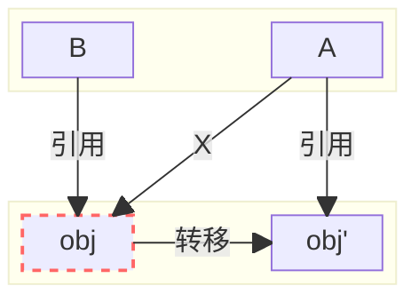

### 为什么GC需要STW？
1. 标记对象的时候可能新增引用或者删除引用
2. 转移存活对象时，可能有多个引用指向同一个存活对象，需要同时更新对象的引用

### 为什么ZGC几乎不需要停顿？
1. 解决了存活对象转移长时间停顿的问题
2. 优化GC Roots扫描时的停顿问题
### 读屏障解决什么问题

### 读屏障触发条件

### 读屏障实现细节

### 参考资料
[1] [ZGC-Jfokus-2018.pdf](https://cr.openjdk.org/~pliden/slides/ZGC-Jfokus-2018.pdf)

[2] [How ZGC allocates memory for the Java heap](https://joelsiks.com/posts/zgc-heap-memory-allocation/)
