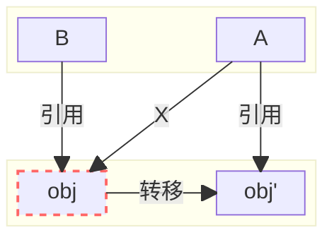

### 为什么GC需要STW？
1. 标记对象的时候可能新增引用或者删除引用
2. 转移存活对象时，可能有多个引用指向同一个存活对象，需要同时更新对象的引用


为了使转移前后的两个对象保持一致，需要满足以下两个要求
>1. 转移完成前应用线程不能更新旧对象，否则，复制后的新对象未同步更新，更新丢失
>2. 转移完成后需要更新所有引用旧对象的指针，将其指向新对象，引用全部更新后对象才可用

问题：怎么实现同时修改所有引用某个对象的指针，不遗漏?  
> 对象引用是指针的指针，保存的是句柄的地址，句柄保存对象真实地址，先访问句柄获取真实地址，再使用真实地址获取对象属性
> ```mermaid
> flowchart LR
> refA & refB---->oop("句柄(oop)")---->obj & obj'
> style obj stroke:#f66,stroke-width:2px,stroke-dasharray: 5 5
> ```
> 对象转移后将句柄中的值修改为转移后的地址即可  
> ```C++
> src/hotspot/cpu/x86/gc/z/zBarrierSetAssembler_x86.cpp
> #define __ masm->
> 218  void ZBarrierSetAssembler::load_at(MacroAssembler* masm,
>                            DecoratorSet decorators,
>                            BasicType type,
>                            Register dst,
>                            Address src,
>                            Register tmp1) {
> ...
> 248  // Load address
> 249  __ lea(scratch, src);
> 250
> 251  // Load oop at address
> 252  __ movptr(dst, Address(scratch, 0));
> ```

### 为什么ZGC几乎不需要停顿？
1. 解决了存活对象转移长时间停顿的问题
  - GC线程标记对象是否存活，转移存活对象，修改对象句柄中的状态位，更新转发表
  - 转发表保存转移前的对象与转移后的对象之间的地址映射关系
  - 读屏障：应用线程在获取引用类型的字段时对句柄中的真实地址进行检测和更新
  - 根据真实地址中的状态位判断字段是否需要转移
> 核心思想是使应用线程与GC线程可以并行转移对象

> 传统GC需要STW来实现GC前后对象一致，ZGC应用线程与GC线程可以并发转移，不需要STW
2. 优化GC Roots扫描时的停顿问题  
[JEP 376: ZGC: Concurrent Thread-Stack Processing](https://openjdk.org/jeps/376)
### 读屏障解决什么问题
用于检测句柄是否需要更新

### 读屏障触发条件
从堆中加载对象句柄时触发，在getfield字节码中实现
```C++
src/hotspot/cpu/x86/templateTable_x86.cpp
150     static void do_oop_load(InterpreterMacroAssembler* _masm,
151                             Address src,  \\ field
152                             Register dst, \\ rbx
153                             DecoratorSet decorators = 0) {
        // macroAssembler_x86.cpp 6036
154       __ load_heap_oop(dst, src, rdx, decorators);
155     }
...
2661    void TemplateTable::getfield(int byte_no) {
2662      getfield_or_static(byte_no, false);
2663    }
...
2513    void TemplateTable::getfield_or_static(int byte_no, bool is_static, RewriteControl rc) {
...
2530    const Address field(obj, off, Address::times_1, 0*wordSize);
...
2565    // atos
2566    do_oop_load(_masm, field, rax);
2567    __ push(atos);
2568    if (!is_static && rc == may_rewrite) {
2569      patch_bytecode(Bytecodes::_fast_agetfield, bc, rbx);
2570    }
2571    __ jmp(Done);
```


GC Root引用的对象会在初始转移阶段转移(STW)，不需要读屏障
### 读屏障实现细节

```C++
src/hotspot/cpu/x86/macroAssembler_x86.cpp
6012    void MacroAssembler::access_load_at(BasicType type, DecoratorSet decorators, Register dst, Address src,
6013                                        Register tmp1) {
6014      BarrierSetAssembler* bs = BarrierSet::barrier_set()->barrier_set_assembler();
6015      decorators = AccessInternal::decorator_fixup(decorators, type);
6016      bool as_raw = (decorators & AS_RAW) != 0;
6017      if (as_raw) {
6018        bs->BarrierSetAssembler::load_at(this, decorators, type, dst, src, tmp1);
6019      } else {
6020        bs->load_at(this, decorators, type, dst, src, tmp1);
6021      }
6022    }
...
6036    void MacroAssembler::load_heap_oop(Register dst, Address src, Register tmp1, DecoratorSet decorators) {
          // 注：dst -> rbx src -> field tmp1 -> rdx
6037      access_load_at(T_OBJECT, IN_HEAP | decorators, dst, src, tmp1);
6038    }
```
读屏障实现代码：
```C++
src/hotspot/cpu/x86/gc/z/zBarrierSetAssembler_x86.cpp
218     void ZBarrierSetAssembler::load_at(MacroAssembler* masm,
219                                        DecoratorSet decorators,
220                                        BasicType type,
221                                        Register dst,
222                                        Address src,
223                                        Register tmp1) {
          // 非引用类型barrier_needed返回false，跳过读屏障
224       if (!ZBarrierSet::barrier_needed(decorators, type)) { 
225         // Barrier not needed
226         BarrierSetAssembler::load_at(masm, decorators, type, dst, src, tmp1);
227         return;
228       }
229     
230       BLOCK_COMMENT("ZBarrierSetAssembler::load_at {");
231     
232       // Allocate scratch register
233       Register scratch = tmp1;
234       if (tmp1 == noreg) {
235         scratch = r12;
236         __ push(scratch);
237       }
238     
239       assert_different_registers(dst, scratch);
240     
241       Label done;
242       Label uncolor;
243     
244       //
245       // Fast Path
246       //
247     
248       // Load address
249       __ lea(scratch, src);
250     
251       // Load oop at address
252       __ movptr(dst, Address(scratch, 0));
253     
254       const bool on_non_strong =
255           (decorators & ON_WEAK_OOP_REF) != 0 ||
256           (decorators & ON_PHANTOM_OOP_REF) != 0;
257     
258       // Test address bad mask
259       if (on_non_strong) {
260         __ testptr(dst, mark_bad_mask_from_thread(r15_thread));
261       } else {
262         __ testptr(dst, load_bad_mask_from_thread(r15_thread));
263       }
264     
265       __ jcc(Assembler::zero, uncolor);
266     
267       //
268       // Slow path
269       //
270     
271       {
272         // Call VM
273         ZRuntimeCallSpill rcs(masm, dst, ZXMMSpillMode::avx128);
            // zBarrierSetRuntime.cpp 77
274         call_vm(masm, ZBarrierSetRuntime::load_barrier_on_oop_field_preloaded_addr(decorators), dst, scratch);
275       }
276     
277       // Slow-path has already uncolored
278       __ jmp(done);
279     
280       __ bind(uncolor);
          // 将染色指针转换成普通指针
281     
282       __ movptr(scratch, rcx); // Save rcx because shrq needs shift in rcx
283       __ movptr(rcx, ExternalAddress((address)&ZPointerLoadShift));
284       if (dst == rcx) {
285         // Dst was rcx which is saved in scratch because shrq needs rcx for shift
286         __ shrq(scratch);
287       } else {
288         __ shrq(dst);
289       }
290       __ movptr(rcx, scratch); // restore rcx
291     
292       __ bind(done);
293     
294       // Restore scratch register
295       if (tmp1 == noreg) {
296         __ pop(scratch);
297       }
298     
299       BLOCK_COMMENT("} ZBarrierSetAssembler::load_at");
300     }
```
下图对应zBarrierSetAssembler_x86.cpp 248-265行

慢路径实现代码：
```C++
src/hotspot/share/gc/z/zBarrier.inline.hpp
322     template <typename ZBarrierSlowPath>
323     inline zaddress ZBarrier::barrier(ZBarrierFastPath fast_path, ZBarrierSlowPath slow_path, ZBarrierColor color, volatile zpointer* p, zpointer o, bool allow_null) {
324       z_verify_safepoints_are_blocked();
325     
326       // Fast path
327       if (fast_path(o)) {
328         return ZPointer::uncolor(o);
329       }
330     
331       // Make load good
332       const zaddress load_good_addr = make_load_good(o);
333     
334       // Slow path
335       const zaddress good_addr = slow_path(load_good_addr);
336     
337       // Self heal
338       if (p != nullptr) {
339         // Color
340         const zpointer good_ptr = color(good_addr, o);
341     
342         assert(!is_null(good_ptr), "Always block raw null");
343     
344         self_heal(fast_path, p, o, good_ptr, allow_null);
345       }
346     
347       return good_addr;
348     }
...
465     inline zaddress ZBarrier::load_barrier_on_oop_field_preloaded(volatile zpointer* p, zpointer o) {
466       auto slow_path = [](zaddress addr) -> zaddress {
467         return addr;
468       };
469     
470       return barrier(is_load_good_or_null_fast_path, slow_path, color_load_good, p, o);
471     }
```
```C++
src/hotspot/share/gc/z/zBarrierSetRuntime.cpp
29      JRT_LEAF(oopDesc*, ZBarrierSetRuntime::load_barrier_on_oop_field_preloaded(oopDesc* o, oop* p))
30        return to_oop(ZBarrier::load_barrier_on_oop_field_preloaded((zpointer*)p, to_zpointer(o)));
31      JRT_END
...
77      address ZBarrierSetRuntime::load_barrier_on_oop_field_preloaded_addr(DecoratorSet decorators) {
78        if (decorators & AS_NO_KEEPALIVE) {
79          if (decorators & ON_PHANTOM_OOP_REF) {
80            return no_keepalive_load_barrier_on_phantom_oop_field_preloaded_addr();
81          } else if (decorators & ON_WEAK_OOP_REF) {
82            return no_keepalive_load_barrier_on_weak_oop_field_preloaded_addr();
83          } else {
84            assert((decorators & ON_STRONG_OOP_REF), "Expected type");
85            // Normal loads on strong oop never keep objects alive
86            return load_barrier_on_oop_field_preloaded_addr();
87          }
88        } else {
89          if (decorators & ON_PHANTOM_OOP_REF) {
90            return load_barrier_on_phantom_oop_field_preloaded_addr();
91          } else if (decorators & ON_WEAK_OOP_REF) {
92            return load_barrier_on_weak_oop_field_preloaded_addr();
93          } else {
94            assert((decorators & ON_STRONG_OOP_REF), "Expected type");
              // AS_NORMAL执行入口
95            return load_barrier_on_oop_field_preloaded_addr();
96          }
97        }
98      }
99
100      address ZBarrierSetRuntime::load_barrier_on_oop_field_preloaded_addr() {
101        return reinterpret_cast<address>(load_barrier_on_oop_field_preloaded);
102      }
```

### 参考资料
[1] [ZGC-Jfokus-2018.pdf](https://cr.openjdk.org/~pliden/slides/ZGC-Jfokus-2018.pdf)

[2] [ZGC-Joker-2021.pdf](https://cr.openjdk.org/~pliden/slides/ZGC-Joker-2021.pdf)

[3] [How ZGC allocates memory for the Java heap](https://joelsiks.com/posts/zgc-heap-memory-allocation/)
