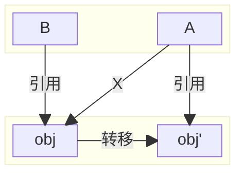

### 为什么GC需要STW？
1. 标记对象的时候可能新增引用或者删除引用
2. 转移存活对象时，可能有多个引用指向同一个存活对象，需要同时更新对象的引用

为了使转移前后的两个对象保持一致，需要满足以下两个要求
>1. 转移过程中应用线程不能更新旧对象，否则更新可能丢失
>2. 转移完成后需要同时更新所有引用旧对象的指针，将其指向新对象
### 为什么ZGC几乎不需要停顿？
1. 解决了存活对象转移长时间停顿的问题
  - GC线程标记对象是否存活，转移存活对象，修改对象句柄中的状态位，更新转发表
  > 问题：ZGC怎么实现同时修改所有引用某个对象的指针，保证指针没有遗漏?  
  > ZGC使用两次寻址，引用保存的是句柄的地址，句柄保存对象真实地址，先访问句柄获取真实地址，再访问对象
  > ```mermaid
  > flowchart LR
  > refA & refB---->oop("句柄(oop)")---->obj
  > ```
  > 更新地址时只需更新对象句柄中的地址信息即可  
  >
  >     src/hotspot/cpu/x86/gc/z/zBarrierSetAssembler_x86.cpp
  >     #define __ masm->
  >     218  void ZBarrierSetAssembler::load_at(MacroAssembler* masm,
  >                                DecoratorSet decorators,
  >                                BasicType type,
  >                                Register dst,
  >                                Address src,
  >                                Register tmp1) {
  >     ...
  >     248  // Load address
  >     249  __ lea(scratch, src);
  >     250
  >     251  // Load oop at address
  >     252  __ movptr(dst, Address(scratch, 0));

  - 转发表保存转移前的对象与转移后的对象之间的映射关系
  - 读屏障：应用线程在获取引用类型的字段时对指针进行检测和更新
  - 根据指针中的状态位判断字段是否需要转移
> 核心思想是使应用线程与GC线程可以并行转移对象

> 传统GC需要STW来实现GC前后对象一致，ZGC应用线程与GC线程可以并发转移，不需要STW
2. 优化GC Roots扫描时的停顿问题
### 读屏障解决什么问题

### 读屏障触发条件


### 读屏障实现细节


### 参考资料
[1] [ZGC-Jfokus-2018.pdf](https://cr.openjdk.org/~pliden/slides/ZGC-Jfokus-2018.pdf)

[2] [How ZGC allocates memory for the Java heap](https://joelsiks.com/posts/zgc-heap-memory-allocation/)
